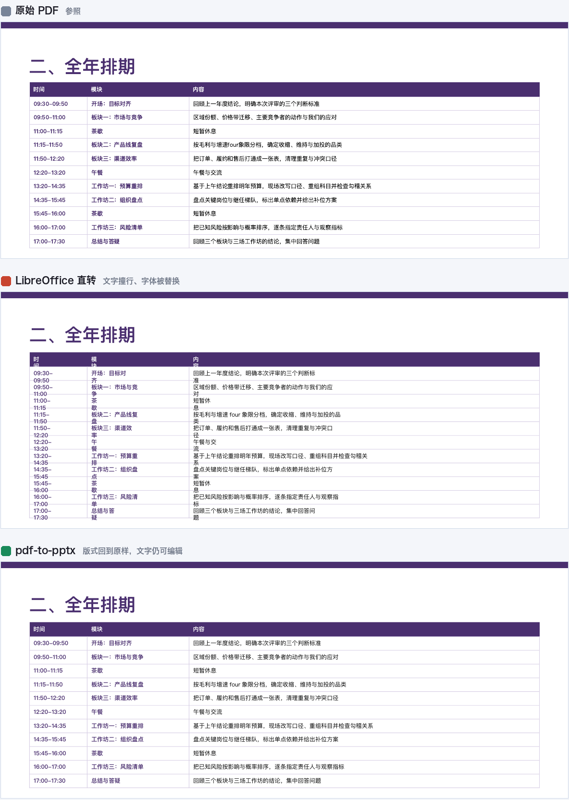

# pdf-to-pptx

Convert a PDF into an **editable** PowerPoint deck — real text boxes, real vector
shapes, real pictures. Not one screenshot per slide.

[中文文档](./README.zh-CN.md) · MIT licensed



The middle panel is what you get from `soffice --convert-to pptx` on its own:
the text wraps inside boxes that were measured for a font the machine doesn't have,
and collides. The right panel is the same file through this tool.

---

## Why this exists

LibreOffice already has a PDF import filter, and it is genuinely good — it turns PDF
text objects back into text boxes and vector paths back into shapes. One command gets
you 90% of the way:

```bash
soffice --headless --infilter="impress_pdf_import" --convert-to pptx deck.pdf
```

The remaining 10% is what makes the difference between "a file" and "a file you can
send to a client". This tool is that 10%, and **all of it is CJK-hostile-by-default
behaviour that you only notice after you've already sent the deck**:

| # | What LibreOffice emits | What breaks | Fix |
|---|---|---|---|
| 1 | Font names without spaces: `MicrosoftYaHei` | PowerPoint can't resolve the name and substitutes the whole deck | Rename to `Microsoft YaHei` |
| 1b | Only `a:latin` is written, never `a:ea` | The East Asian half of every run has no font declared | Set `a:ea` on every CJK-bearing run |
| 2 | Text boxes sized to the original font, wrap left on | Any font substitution reflows text into the line below — overlapping glyphs | `word_wrap = False`, drop autofit |
| 3 | Some ideographs come back as Kangxi radicals (`⽰` U+2F70, not `示` U+793A) | Looks identical, but copy/paste and search silently fail | NFKC + a curated radical table |
| 4 | Letter-spaced source text gets a space between every character (`擅 长 领 域`) | Same — the text *looks* right and is unsearchable | Collapse when every CJK char is single-space separated (≥3 chars) |

Fixes 3 and 4 are the ones people don't know to look for. A deck can look pixel-perfect
and still have text nobody can grep.

## Install

No bundled binaries. Two system prerequisites, one command to check them:

```bash
./bin/pdf-to-pptx --doctor
```

| Requirement | Install | Needed for |
|---|---|---|
| LibreOffice | `brew install --cask libreoffice` · `apt install libreoffice-impress` | everything |
| poppler | `brew install poppler` · `apt install poppler-utils` | `--verify` and the scanned-PDF pre-check |
| python-pptx, pillow | installed automatically into `.venv` on first run | everything |

LibreOffice is ~800 MB and MPL-2.0. Vendoring it into this repo for four platforms
would be absurd, so it stays a prerequisite — the same way `html-to-pptx` treats Chrome.

## Usage

```bash
# Output lands next to the input, same base name
./bin/pdf-to-pptx deck.pdf

# Render the result back to PDF and produce side-by-side comparison images.
# Do this the first time you convert any new deck.
./bin/pdf-to-pptx deck.pdf --verify

# Only compare the pages you care about
./bin/pdf-to-pptx deck.pdf --verify --verify-pages 1,5,6
```

| Flag | Purpose |
|---|---|
| `-o, --out` | Output path or directory (default: alongside the input) |
| `--verify` | Render back to PDF, emit per-page side-by-side comparisons |
| `--verify-pages 1,5,6` | Limit the comparison to these pages |
| `--verify-dpi N` | Comparison image resolution (default 80) |
| `--cjk-font "PingFang SC"` | Force the East Asian typeface (default: whichever font carries the most CJK text) |
| `--font-map "FooBar=Foo Bar"` | Additional rename rule, repeatable |
| `--keep-wrap` | Keep LibreOffice's wrap setting (skip fix 2) |
| `--no-text-cleanup` | Keep compatibility characters and per-character spaces (skip fixes 3 and 4) |
| `--no-postfix` | Emit LibreOffice's raw output, unmodified |
| `--soffice PATH` | Point at a specific LibreOffice binary |

## Verify, don't trust the shape counts

The tool prints a per-page inventory:

```
页数 10
  页     形状    文本框     字符    矢量    图片
  1      24      4     36    18     1
  5      85     55    815    29     1
```

**This table cannot tell you the deck looks right.** Overlapping text, drifted
colour blocks and clipped lines are all invisible to it. The deck that motivated this
tool had a perfect inventory and one completely garbled page. That is what `--verify`
is for — it writes `cmp-NN.png` files with the original and the result side by side.
Look at them. Especially the busiest page and the cover.

## Known limits

- **Scanned PDFs (no text layer) are out of scope.** You get pictures, not text.
  The tool detects this and warns; OCR first.
- **Tables are not native PowerPoint tables.** A 13-row table becomes ~55 independent
  text boxes plus lines. Editing cell text is fine; inserting rows, changing column
  widths and applying table styles are not. If the recipient needs to work with it
  *as a table*, this route won't do.
- **Gradients, transparency and blend modes** collapse to approximate solid fills.
  Check brand-heavy cover pages against the comparison image.
- **Bold CJK depends on the font actually being installed.** Rendering thin on a
  machine without Microsoft YaHei does not mean bold was lost — check `run.font.bold`
  before concluding anything.
- **The radical table is curated, not exhaustive.** Compatibility characters outside
  it are left alone and reported with a warning rather than guessed at. Adding an
  entry to `RADICAL_SUPPLEMENT` in `scripts/convert.py` is a one-line PR.
- **If it can be avoided, avoid it.** Ask whoever sent the PDF for the source `.pptx`.
  Every conversion is lossy; this tool is the best available answer when the source
  is genuinely gone, not a replacement for having it.

## Use with Claude Code

```bash
git clone https://github.com/yuna78/pdf-to-pptx.git ~/.claude/skills/pdf-to-pptx
```

That makes it a global skill (alongside `html-to-pptx`) and
`SKILL.md` makes it available as a skill — say "convert this PDF to PowerPoint" and it
will run. It also works as a plain CLI with no Claude involved.

## Tests

```bash
python3 -m venv .venv && .venv/bin/pip install python-pptx pillow pytest
.venv/bin/python -m pytest tests/ -q
```

The fixture (`tests/fixtures/sample-deck.pdf`) is a synthetic deck about a fictional
company, generated by `tests/make_fixture.py`. It contains no real material from
anyone. Tests assert that each fix *changed something* relative to `--no-postfix`, so
a fix silently ceasing to apply fails the suite rather than passing vacuously.

## Licensing notes

This project is MIT. It invokes LibreOffice (MPL-2.0) and poppler (GPL-2.0/3.0) as
**separate processes** via `subprocess`, and does not link against either. Under the
usual reading of the GPL, that is aggregation rather than a derivative work, so the
copyleft terms do not propagate here. This is the common industry understanding and
not legal advice — get your own if you plan to redistribute a bundle.
